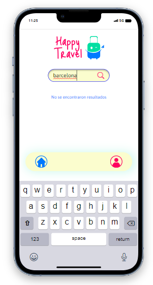

# DREAMSCAPE TRAVEL  

Alongside [this back-end repository](https://github.com/Jasz-17/dreamscape_back), this fullstack project involves the creation of a responsive website that allows users to post, edit, and delete their dream holiday destinations as well as view the holiday plans of other users. 

## Table of Contents

- [Images](#images)
- [Description](#description)
- [Technologies](#technologies)
- [Database Diagram](#databasediagram)
- [Testing](#testing)
- [Installation](#installation)
- [Contributors](#contributors)

## Images

## Description

This project involved the creation of multiple-page responsive website, using React, Next.js, PHP, and Laravel. The site design, as specified by the fictional client 'Happy Travel' via a detailed [Figma mock-up](https://www.figma.com/file/twPJOzEo5hZJZ7srsEt10y/HappyTravel?type=design&node-id=4-1343&mode=design&t=Ws3hTyk3DDJ71bok-0), features various unique elements and pages. These include a search bar for finding holiday destinations with ease, a registration form for new users, and a login form for existing users. The site itself features a gallery of personalized holiday destinations that registered users are able to add to, edit, and delete, and users without an account are able to view and search. 

## Technologies 
This project used the following technologies and their specific versions:

- React - 18
- Next.js - 14.1.0
- Tailwind CSS - 3.3.0
- Node.js - 20.9.0
- Vitest - 1.3.1
- Cypress - 13.6.6
- Axios - 1.6.7
- Class Variance Authority (cva) - 0.7.0 
-----
- PHP - 8.1
- Laravel - 10.10
- MySQL - 8.0
- Xampp - 3.3.0
- Sanctum - 3.3
- PHPUnit - 10.1
- Composer - 2.6.6

## Database Diagram
This data base diagram shows that there is a one to many relationship as single users can create an unlimited number of destinations. The primary keys of both the users table and destinations table are their ids while the foreign key "user_id" on destinations is what connects the two tables, ensuring that the user's id is attached to the destination when created, identifying them as the only ones able to edit or delete the destination. 

   

## Testing
In the front-end, this project used Vitest for unit testing and Cypress for end-to-end testing. Combined, these tests verified that the various pages and their components were being rendered properly while also ensuring a smooth user experience by simulating actions such as logging in and registering as a new user. 

In the back-end, this project used PHPUnit to test user routes and endpoint access when authorized or not.

## Installation

- Clone both this front-end repository and [this backend repository](https://github.com/Jasz-17/dreamscape_back) in separate folders on your device
- In the front-end terminal, the command 'npm install' will ensure that you have all the necessary technologies used 
- After creating a database called 'dreamscape' in MySQL, run the command 'php artisan migrate:fresh --seed' in the back-end terminal to populate your database with a selection of user and destination seeders   
- To view the page, ensure that MySQL is running, enter 'npm run dev' in the front-end terminal and 'php artisan serve' in the back-end terminal

## Contributors

[Débora Menezes, Fullstack Developer](https://github.com/debora-smb)  
[Jéssica Solózano, Fullstack Developer](https://github.com/jazs-17)  
[Vicki Robertson, Fullstack Developer](https://github.com/vicki-robertson)  
[Laura Artaza, Fullstack Developer](https://github.com/lolamindi)  

---

Back to: [Table of Contents](#table-of-contents)
